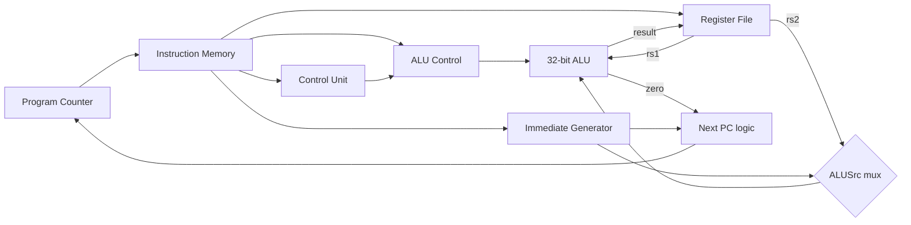
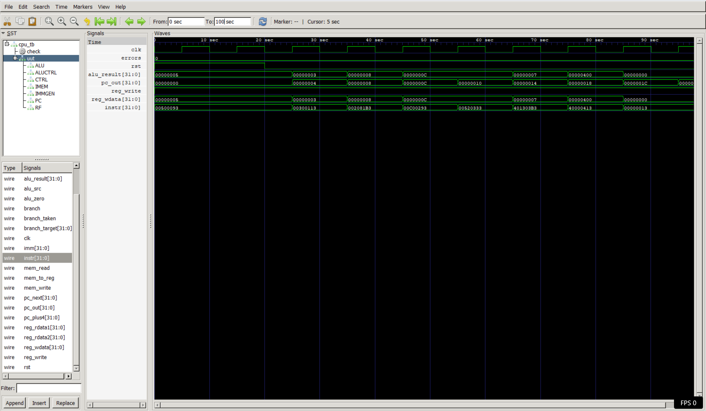

# Hardware Projects
A collection of hardware designs built in Verilog
as part of my journey toward computer architecture and AI hardware engineering.

---

## Project 1 — 4-bit ALU

### What it is
A 4-bit Arithmetic Logic Unit (ALU) implemented in Verilog.
The ALU is the fundamental computational unit of every CPU —
it performs arithmetic and logic operations on binary data.

### Operations supported
| Op Code | Operation | Example |
|---------|-----------|---------|
| 000 | Addition | 5 + 3 = 8 |
| 001 | Subtraction | 9 - 4 = 5 |
| 010 | Bitwise AND | 6 AND 3 = 2 |
| 011 | Bitwise OR | 6 OR 3 = 7 |
| 100 | Bitwise XOR | 6 XOR 3 = 5 |

### Files
- `alu.v` — ALU module
- `alu_tb.v` — Testbench

### How to run
```
iverilog -o alu_tb alu_tb.v alu.v
vvp alu_tb
gtkwave alu_tb.vcd
```

### Simulation output


---

## Project 2 — 32x32 Register File

### What it is
A register file with 32 registers of 32 bits each.
This is the register file used inside a RISC-V CPU.
Two simultaneous read ports, one clocked write port.
Register x0 is hardwired to zero per the RISC-V specification.

### Files
- `reg_file.v` — Register file module
- `reg_file_tb.v` — Testbench

### How to run
```
iverilog -o reg_file_tb reg_file_tb.v reg_file.v
vvp reg_file_tb
gtkwave reg_file_tb.vcd
```

### Simulation output


---

## Project 3 — Vending Machine FSM

### What it is
A finite state machine implementing a vending machine in Verilog.
Accepts 5 cent and 10 cent coins, dispenses an item when 20 cents
is reached, and gives change if overpaid.

### States
| State | Meaning |
|-------|---------|
| IDLE | 0 cents inserted |
| S5 | 5 cents inserted |
| S10 | 10 cents inserted |
| S15 | 15 cents inserted |
| DISP | Dispense item |
| DISP_CHG | Dispense item and give change |

### Files
- `vending.v` — FSM module
- `vending_tb.v` — Testbench

### How to run
```
iverilog -o vending_tb vending_tb.v vending.v
vvp vending_tb
gtkwave vending_tb.vcd
```

### Simulation output


---

## Project 4 — UART Transmitter

### What it is
A UART (Universal Asynchronous Receiver Transmitter) transmitter
implemented in Verilog. Sends an 8-bit byte serially with a start
bit and stop bit at 9600 baud.

### Files
- `uart_tx.v` — UART transmitter module
- `uart_tx_tb.v` — Testbench

### How to run
```
iverilog -o uart_tx_tb uart_tx_tb.v uart_tx.v
vvp uart_tx_tb
gtkwave uart_tx_tb.vcd
```

### Simulation output


---

## Project 5: Single-Cycle RISC-V CPU (RV32I subset)

### What it is
A single-cycle RISC-V processor written in Verilog. Every instruction is fetched, decoded, executed, and written back in one clock cycle. The CPU runs real RISC-V machine code that I hand-encoded from assembly into hex.

### Modules
| Module | File | Role |
|--------|------|------|
| Program Counter | `pc.v` | Holds the current instruction address, updates every clock edge |
| Instruction Memory | `imem.v` | 64-word program memory, returns the instruction at the PC |
| Control Unit | `control.v` | Decodes the opcode into datapath control signals |
| ALU Control | `alu_ctrl.v` | Uses ALUOp, funct3 and funct7 to pick the ALU operation |
| 32-bit ALU | `alu32.v` | add, sub, and, or, xor, sll, srl, slt, plus a zero flag |
| Immediate Generator | `imm_gen.v` | Extracts and sign-extends immediates (I, S, B, J formats) |
| Register File | `reg_file.v` | 32 x 32-bit registers, 2 read ports, 1 write port, x0 hardwired to zero |
| Top level | `cpu.v` | Wires the datapath together, including next-PC and branch logic |

### Block diagram


### Test program (hand-encoded)
| Address | Hex | Assembly | Expected |
|---------|-----|----------|----------|
| 0x00 | `00500093` | `addi x1, x0, 5` | x1 = 5 |
| 0x04 | `00300113` | `addi x2, x0, 3` | x2 = 3 |
| 0x08 | `002081B3` | `add x3, x1, x2` | x3 = 8 |
| 0x0C | `00C00293` | `addi x5, x0, 12` | x5 = 12 |
| 0x10 | `00520333` | `add x6, x4, x5` | x6 = 12 |
| 0x14 | `401303B3` | `sub x7, x6, x1` | x7 = 7 |
| 0x18 | `40000413` | `addi x8, x0, 1024` | x8 = 1024 |

The testbench is self-checking: it compares every register against its expected value and prints PASS or FAIL.

### How to run
```
iverilog -o cpu_sim cpu_tb.v cpu.v pc.v imem.v control.v reg_file.v imm_gen.v alu_ctrl.v alu32.v
vvp cpu_sim
gtkwave cpu_tb.vcd
```

### Expected output
```
---- Register checks ----
PASS  x0 = 0
PASS  x1 = 5
PASS  x2 = 3
PASS  x3 = 8
PASS  x4 = 0
PASS  x5 = 12
PASS  x6 = 12
PASS  x7 = 7
PASS  x8 = 1024
ALL TESTS PASSED
```

### Bugs found and fixed
**1. Wrong funct7 bit when hand-encoding `sub`.** My first encoding of `sub x7, x6, x1` put the funct7 bit in the wrong position (`0000001` instead of `0100000`), so the CPU added instead of subtracting (x7 = 17 instead of 7). I traced it by decoding my own hex back into fields and checking which instruction bit `alu_ctrl` actually reads (bit 30).

**2. I-type instructions could be decoded as subtract.** `alu_ctrl` was reading instruction bit 30 as funct7 for every instruction, but for I-type instructions like `addi`, bit 30 is part of the immediate. So `addi x8, x0, 1024` (immediate bit 10 set) computed 0 - 1024 instead of 0 + 1024. My original test program never set that bit, so every test passed while the bug was still there. Fix: only pass funct7 to the ALU control for R-type instructions. The `addi x8, x0, 1024` test was added as a regression check.

### Simulation output


### Next steps
- Data memory with `lw` / `sw`
- Branch (`beq`) test cases
- 5-stage pipelined version with forwarding, load-use stall, and branch flush
